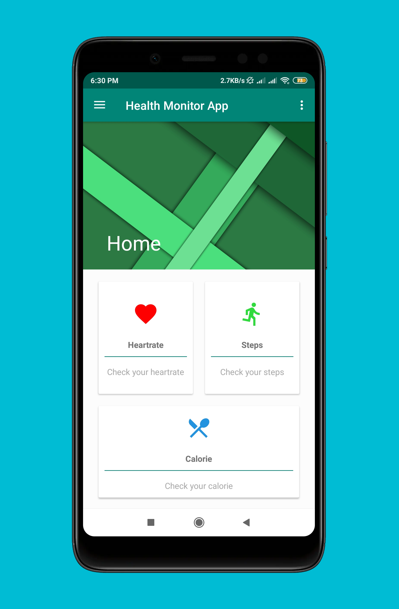
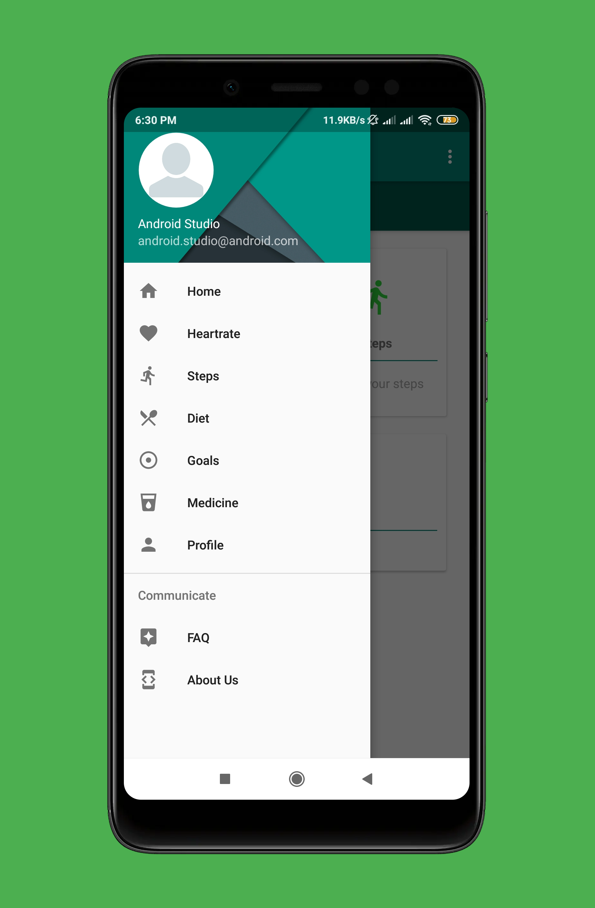
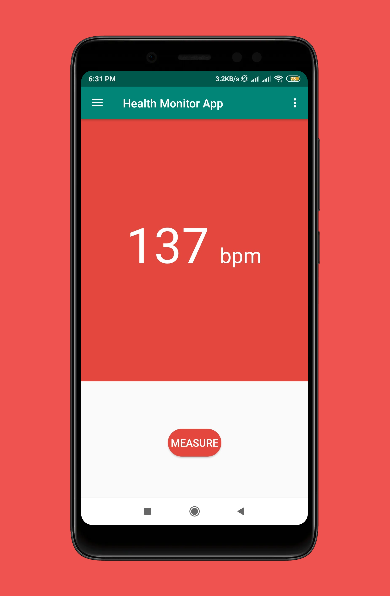
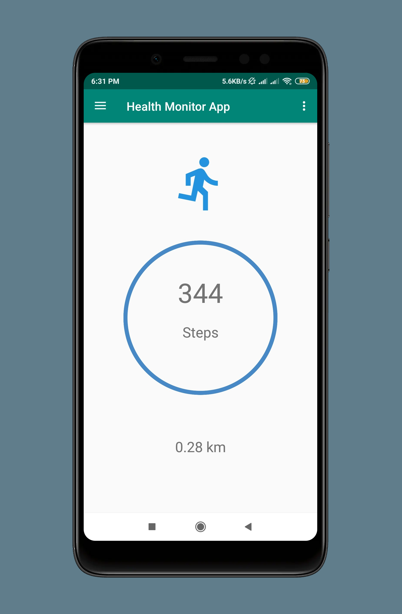
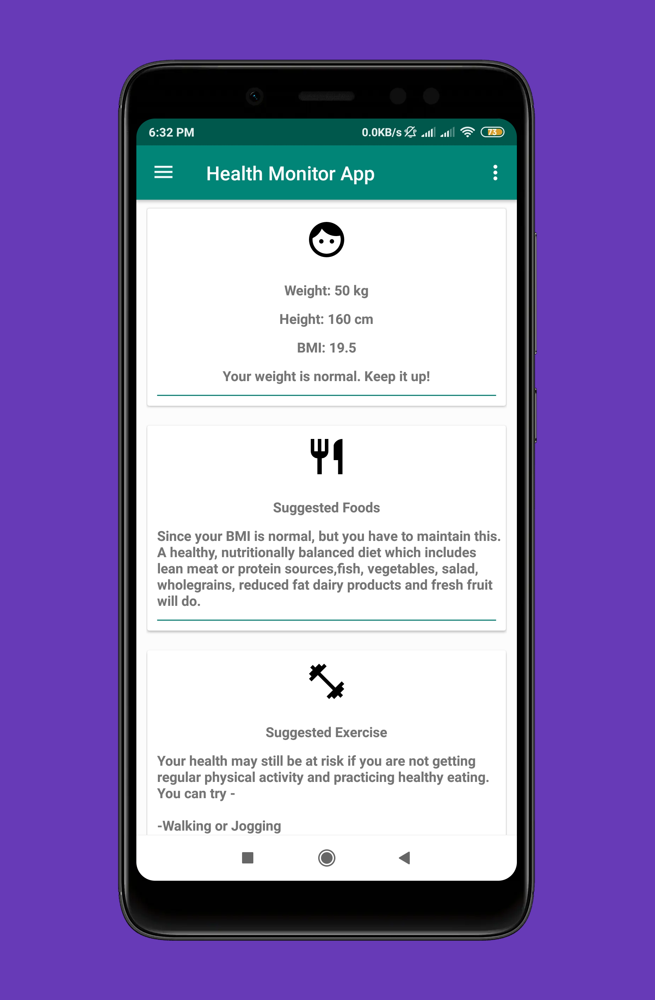

# MobileHealthApp

'Health Monitoring App' helps you keep track of your health features such as heart rate and calorie count. It also keeps track of your steps per day and gives health suggestions as per your body condition. It provides diet and exercise plans to live a healthy life. There is also a fature called medicine reminder that will send a notification for your daily pills.

**Contribution :**
1. [Rusafa Binte Sohrawardi](https://github.com/RusafaDosta)
2. [Md. Sayeed Abid](https://github.com/SayeedAbid)
